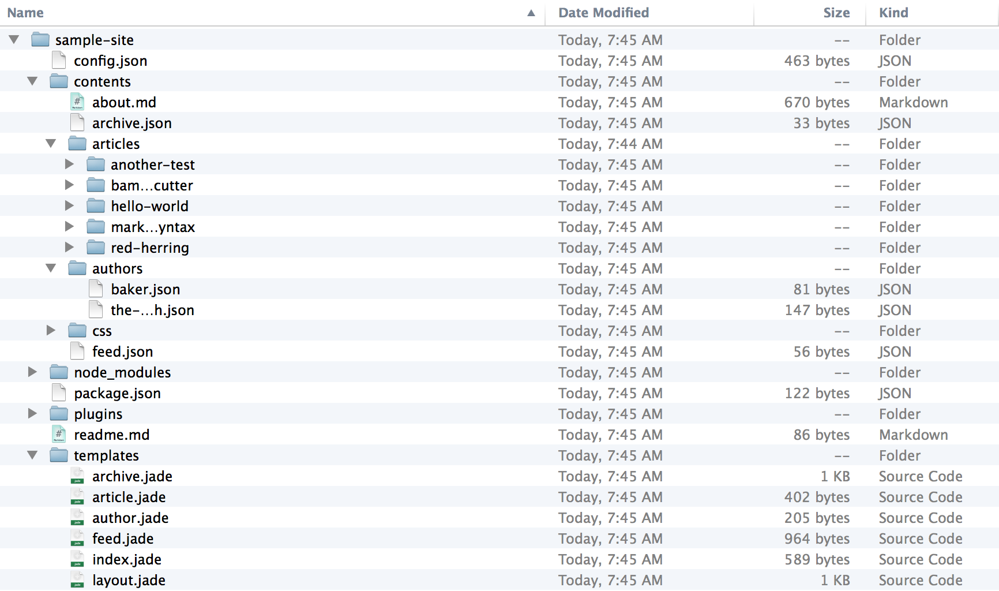

In the last post, [The Need for a Static Site Generator](/articles/move-to-static-site-generator/), I outlined the process I went through to determine why I needed a static site generator and then my criteria for choosing one.  In this post, I want to outline basic steps for getting started with Wintersmith, review the templating engine I chose, and analyze the process for authoring content with Markdown.

## Getting Started with Wintersmith

The best way to get started with Wintersmith is to utilize the new site generation tool that is a part of the core module.  There are also some great examples that are included with the project, but the site generator tool will let you build a nearly complete site with just a single command.

### Installation

To get started, you will need to install Wintersmith.  Getting Wintersmith installed is fairly easy when using npm.  You simply need to type the following:

```
npm install wintersmith -g
```

If this command fails, you may need to add `sudo` before this command on the same line.  This is dictated by how npm was installed on your machine initially.

This command will install Wintersmith globally on your machine.  You can now utilize the command line utility to create a new Wintersmith site, build a site that has been created, or preview the site using the included preview server.

> Yes, <b>Wintersmith does install globally</b>.  In addition, it doesn't have the separation between the cli module and the actual core module (as you might have noticed in projects like <a href="https://github.com/gruntjs/grunt" target="_blank">grunt</a>).  This means that you will need to use the same version of Wintersmith for all of the projects on your machine (or switch versions manually).  While this is a bit of a limitation (and not a best practice for node modules moving forward), I do think it is a small one that I can live with.

### Creating a New Site

One of the features that was greatly improved with some of the newer versions of Wintersmith is the ability to generate a new site from the command line utility.  This saves a great deal of time in the early creation process.  The command can be utlized as follows:

```
wintersmith new <project_name>
```

In the following example, I ran the following command with project name of `sample-site`.  This generated a sample blog with the contents seen below:



This is a great start for someone creating a blog with Wintersmith.  It includes your config file, sample posts, templates, your `package.json` file, and most anything else you would need initially.  By default, the generated project uses Markdown for the content (which we will use) and Jade for the templates (which we will replace).

### Preview Server

After the sample site is created, you can easily preview the generated site by utilizing the included preview server with Wintersmith.  Change to the directory where you created your project (the directory that has the `config.json` file) and enter the following command:

``` 
wintersmith preview
```

Now, if you launch a browser and go to [http://localhost:8080/](http://localhost:8080/) you should see the site live.  In the background Wintersmith is running an <a href="http://expressjs.com/" target="_blank">express</a> server and intelligently deciding when to build specific resources for the site based on what you are requesting.

With this in place, you can go and change some content in the content directory.  Once you change it, you can reload the page of the site and see that change reflected.  This can provide for a very efficient workflow and authoring environment especially when paired with modules like <a href="https://github.com/gruntjs/grunt-contrib-livereload" target="_blank">grunt-contrib-livereload</a>.

### Building the Example Site

Finally, with the sample site in place, you are ready to build it.  Simply enter the following command:

```
wintersmith build
```

Now you can navigate to the `build/` folder and see all of the generated files for the site (this output directory is configurable in the `config.json` file).  Now the site would be ready to upload to your web host.

## Templating

With an understanding of how Wintersmith works, let's shift gears and begin to discuss the process I took in choosing a templating solution to replace Jade.  Luckily Wintersmith has a plugin API for templating, so you should be able to find something that meets your needs.  If not, you can create it.

First, it is important to note that I was extremely picky about templating when going into this.  As mentioned before, I've seen templates done right (I think Expression Engine did this fairly well) and wrong (Wordpress templates violate several different development best practices).  I wanted to find a templating solution that was elegant, minimized needless duplication, and utilized actual HTML (and not some sort of abstraction such as Jade).

I ended up settling on <a href="http://nunjucks.jlongster.com/" target="_blank">Nunjucks</a> (which is a JavaScript port of the <a href="http://jinja.pocoo.org/" target="_blank">jinja2</a> templating engine in python).  Nunjucks supports template inheritance which helps to avoid the needless duplication I mentioned previously.  It also is done in HTML and uses a custom tag syntax for the items generated from the template.  At a glance, it is very easy to determine what is static HTML and what will be inserted by the template engine.  I have found that this approach requires the least amount of effort when transitioning from a mocked up HTML page to being integrated with the static site generator.

Here is the sample template I use for the listing of blog posts:

<script src="https://gist.github.com/davidtucker/6090668.js"></script>

From this there are a few important things to point out:

* The first line shows how the inheritance works.  This template extends the core layout template: ``.
* The layout template includes blocks which the sub-templates can define content for.  As an example, I have a block for the page title.  I can populate that with the following statement in the sub-template: `{{ page.title }}`.  I also have blocks for the canonical URL and the core content of the page.
* There is also a block called meta which uses the `{{ super() }}` directive.  This tells the sub-template to append the information to what the parent template had defined for this block.  In this case, it appends a meta tag in the header.
* Just like any other mature templating solutions, Nunjucks allows for looping over content.  In this case, I am looping over each of the blog posts using this directive: ``.

With this elegant and efficient templating solution, I was able to quickly move from an initial HTML version into Wintersmith with a minimal level of effort.  This was by far a better solution than what I saw from the other options that were available.

> You can see all of the templates I use for my site in the <a href="https://github.com/davidtucker/davidtucker-blog/tree/develop/templates" target="_blank">templates directory</a> of the Github project.

### Integrating with Wintersmith

Luckily, there was an existing <a href="https://github.com/jbuck/wintersmith-nunjucks" target="_blank">wintersmith-nunjucks</a> plugin (written by <a href="https://github.com/jbuck" target="_blank">Jon Buckley</a>).  I was able to leverage this plugin to bring in nunjucks support into my wintersmith project.  To include this plugin, I needed to do two things:

1.  I needed to install the wintersmith-nunjucks plugin using npm (and save it to the development dependencies of my `package.json` file) by running the command: `npm install wintersmith-nunjucks --save-dev`
2.  Next, I needed to add the plugin to my `config.json` file.  With this, I simply needed to add the `'wintersmith-nunjucks'` string to the `plugins` array.  You can see <a href="https://github.com/davidtucker/davidtucker-blog/blob/develop/config-preview.json" target="_blank">an example of one of my current config files</a> which includes this.

With that in place, I was ready to create new templates in my project using nunjucks.

## Content Authoring

For content authoring, I wanted an experience that was as efficient as possible.  Based off of my experience, I knew I wanted to utilize <a href="http://daringfireball.net/projects/markdown/" target="_blank">Markdown</a>.  This provides both ease of use but also nearly unlimited flexibility (since it can include HTML as well.)  Luckily, this support is actually included within the core wintersmith module.  As you have seen earlier, the sample generated project also uses Markdown for its content.

After looking around, I settled on using <a href="http://mouapp.com/" target="_blank">Mou</a> as my Markdown editor of choice for the initial content authoring.  This tool isn't perfect for Wintersmith especially in relation to the metadata section at the top of each markdown page.  However, for a quick quality editing tool this met the need.  

> I am currently investigating how to improve this process and how to create a solution that integrates with Wintersmith as easily as possible.

Here is a sample markdown Wintersmith content file for my About page:

<script src="https://gist.github.com/davidtucker/6091783.js"></script>

## Conclusion

With Wintersmith in place (including a templating engine I liked and a good content authoring solution), I was ready to begin looking at how I was going to automate my entire workflow.  I'm big on workflow, so this part was really enjoyable.  In the next post, I'll be covering how I accomplished this using <a href="http://gruntjs.com/" target="_blank">Grunt</a>.

---
<a name="seriesListing"></a>
## Article Series

* Part 1 - [The Need for a Static Site Generator](/articles/move-to-static-site-generator/)
* Part 2 - [An Introduction to the Wintersmith Process](/articles/introduction-to-wintersmith/)
* Part 3 - [Automating The Development, Build, and Deployment Process with Grunt](/articles/automating-with-grunt/)
* More posts coming soon

