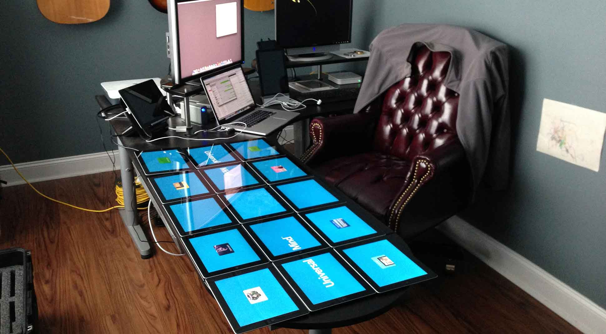
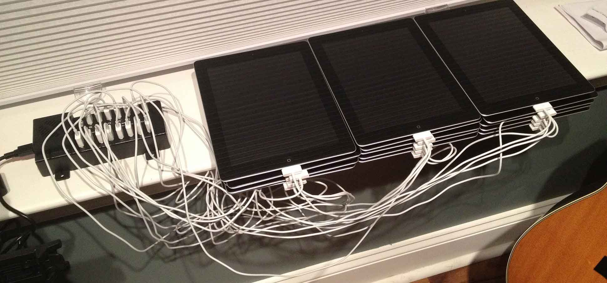

In my role as the Director of Research and Development for Technology at Universal Mind, we consistently take on projects that help us determine where our industry is going and what the limits of technology are.  One area that is a continual focus for us is multi-device communication.  This is an area that we have delved into from time to time.  Early examples of this include iBrainstorm and later our <a href="http://www.universalmind.com/mindshare/entry/gesture-based-content-sharing-the-new-retail-customer-experience" target="_blank">retail demo</a>.

After these initial examples, we wanted to do something bigger.  We wanted to illustrate how several completely different devices could act as a single physical experience.  From this desire, the iPad Table concept was born.

In addition, we are extremely honored 

## What is It

Here is a video of the iPad Table in action:

## How Does it Work

I can always tell when developers are the ones experiencing the table at one of our events.  They always dive instantly into questions about the table and how it works.  I assume several of my readers here are asking the same question.  

Before we dive into the software, there are a few important things to point out:

* The iPads in the table are running standard versions of iOS (no jailbreaking)
* The iPads only communicate on a standard Wifi network (which is housed under the iPads in the table enclosure)

I knew from the beginning that I wanted these devices to work as much like standard devices as I possibly could.  I set the above restrictions before we started any work on the table.

## The Software

The communication between the tables utilized the Universal Mind Multi-Device Framework.  This framework is something I had created early on (although in a very scaled down form) for the retail demo we had done previously.  I added a great deal to it for this project including allowing the developer to specify specific transports for the custom binary protocol.  For the iPad table I wrote two transports: the first is a traditional client to server TCP transport, and the second is a UDP multicast transport.

### UDP Transport

The first transport I actually created was the UDP transport.  For the first few times that we demoed the iPad table, that was all that we utilized.  There were a few big reasons that this was appealing in the beginning:

* For animations that needed to happen all at the same time, using multicast was ideal.  We just simply had to listen for the message, and all devices would receive it at roughly the same time.
* We didn't have to have any _state_ in the transport.  We could simply start or stop listening for messages at any point without having to worry about a connection to a server.

However, it didn't take us long to realize that this could cause problems.  Since this multicast transport was connection-les and since UDP by its nature doesn't guarantee message delivery, we were regularly dropping messages and in the process losing objects in the transfer from one iPad to another.  For some messages, this wasn't a big deal, but for others it was an obvious bug.  At that point I knew we would have to have multiple transports:

* A primary channel for messages which needed to have guaranteed delivery (for example the messages around sending and receiving an object between devices).
* A secondary channel for synchronized animations that all needed to happen at a specific point in time.  While this channel would still not have guaranteed delivery, by limiting the traffic to only this type of message, we would ensure that the messages would most always get through.

This wasn't a perfect solution, but it would work to solve our biggest problems at that time.

### TCP Transport

The main channel of communication is the TCP client-to-server transport.  When the table 'boots up', there is a device that is expected to be the server.  In early versions of the iPad table we used a Mac Mini for the server, but we eventually realized we could utilize an actual iPad for the server with no real performance penalty <em>(we do plan to move back to the Mac Mini in the near future for some of the expanded functionality we have envisioned)</em>. In this state, the other iPads wait until they discover the server on the network and then join the network.  From that point on, the ability to pass objects between iPads is active.

## The Development Process

Frankly, everything about the development process was tedious.  I had no experience at all building an experience and testing it on 15 iPads at the same time.  This manifested itself in the beginning when I began to consider how I was even going to connect 15 devices to 

### Debugging

When....

### Deployment

Deployment was a fairly challenging task to tackle.  I could isolated tests on one or two iPads, but when I wanted to test on all of the devices the wait was horrendous.  At first, I tried an approach where I would archive, 

After that approach revealed some problems (especially with fairly common failed downloads), I decided to take another approach.

I first examined <a href="https://github.com/ghughes/fruitstrap" target="_blank">fruitstrap</a>, a project that handles programmatic deployment of iOS applications to non-jailbroken devices.  This was the catalyst for my new approach.  Since I didn't need to launch the applications and have them all attach to the debugger, I was able to cut out a good deal of the fruitstrap code which no longer worked with iOS 6.  What I was left with was a good example of how to use private API's to handle a programmatic deployment. 

Next, I was able to isolate this code, improve it, and add in a command line wrapper which would allow me to deploy to all 15 devices simultaneously.  I was then able to trigger this from the archive process and deploy a roughly 200MB application out to all 15 devices within 2.5 minutes.  This was roughly a 10x improvement over my first approach.  I called this new command line tool **Distributor Cap**.

> The <b>Distributor Cap</b> source code is not publicly available at this time.  This may be released in the future.  I see this as having limited usefulness, but it would be valuable for anyone else building multi-device experiences.

## The Hardware

To make this work, we needed several pieces of hardware.  The initial version of the table consisted of 15 iPad 2's.  In addition, my co-director Joe Johnston worked to design the physical table which allowed the 15 iPads to be positioned into the surface.  He also worked to have custom cables created that allowed the iPads to be connected to a power source while they were on display.

For charging and syncing we had to utilize some USB hubs that were designed to handle 15 iPads.  For both charging while at events and syncing during the development process we opted for products from Datamation Systems, Inc.  Some of the products that we purchased are no longer sold, but you can see a list of similar products <a href="http://www.pc-security.com/whats_hot/iPad-sync-and-charge.htm" target="_blank">here</a>.

## The Importance

The iPad Table was never designed to be something that others would use as-is (although since those early days we have actually sold versions of it to companies).  Instead, it is a platform for discussion around how multi-device communication can change the way that we interact with our world.  When multiple devices that run the exact same software as the devices we use each day can communicate and seamlessly act as one

