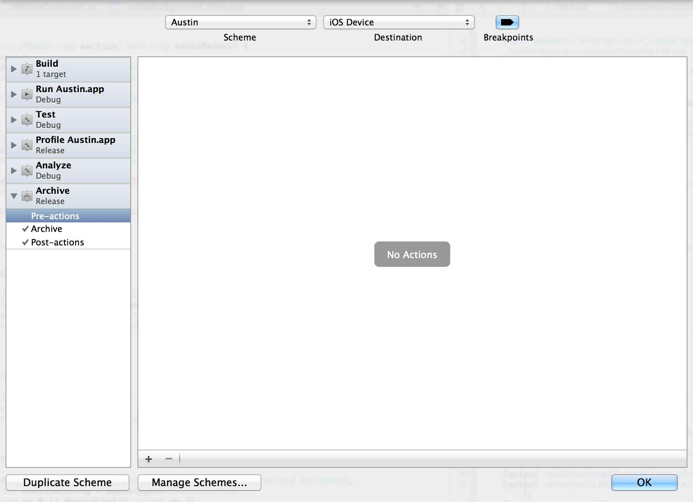

One of the detriments of working with Xcode is that some tasks might not seem immediately automatable.  However, in many cases, this is simply not true.

## Background

While working on the [iPad Table](http://www.cnn.com) project, I had a need to perform an action once the archive process had completed.  In this case, I wanted to perform a [programmatic deployment](http://www.cnn.com) to a few connected devices (15 to be exact).

### Understanding Schemes

Explaining schemes in Xcode 4 is a bit beyond the scope of what I am discussing here, but let me highlight one aspect of them: you can assign pre and post actions to most all of the actions that Xcode generally performs such as building, running, testing, profiling, analyzing, and archiving.

To unlock this power, simply navigate to the Product menu and select *Edit Scheme*.  This will edit the currently selected scheme.  

## Debugging

For those of you who have used *Run Script* actions in the past, you know that if they are in the Build phases, you can simply look at the build logs as a means of debugging your script.  This option however does not apply when using a pre or post action *Run Script*.  In these cases, you need to programmatically capture the output and output it to a log file.  In that way, we can monitor (in real-time) the log file and see what is going on under the covers.

### Capturing the Standard Output

Luckily, we can take advantage of some of the capabilities of Bash to perform some redirection for stdout (Standard Output) of the included script.  

	exec > /tmp/customLog.txt 2>&1
    
If you would like to learn more about redirection, check out [Mitch Frazier's artcile](http://www.linuxjournal.com/content/bash-redirections-using-exec) in the Linux Journal on it.

### Monitoring the Output in Real-Time

When I am monitoring what happened with a script (especially in the beginning when I am developing it), I want to see its output in realtime.  One easy command line tool is the `tail` command.  If we open a new terminal window, we can simply enter the following command:

    tail -f /tmp/customLog.txt
    
With this in place, we can now monitor the output of our script in realtime.

## Implementation

There are several ways that this can be implemented within your normal daily projects.  For example, you can use these same techniques to [upload an iOS application to TestFlight after each successful archive](http://developmentseed.org/blog/2011/sep/02/automating-development-uploads-testflight-xcode/). 